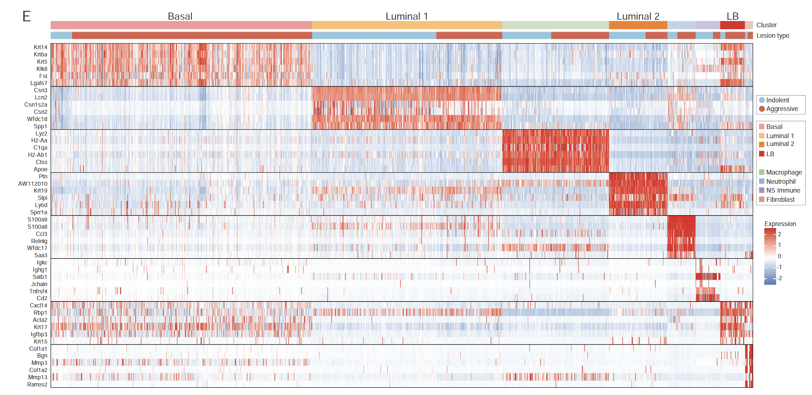

# ScRNA-Seq_HER2

The repository hosts the code for processing and analysis of single cell RNA-seq data in the paper "Single-cell evaluation reveals shifts in the tumor-immune niches that shape and maintain aggressive lesions in the breast", published on [Nature Communications](https://www.nature.com/articles/s41467-021-25240-z). 

To cite this repository, please click the badge below:

